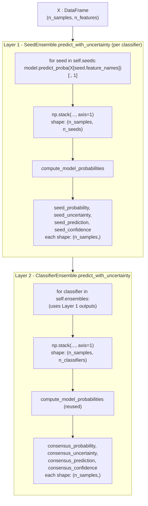

# Consensus Probability Calculation

`ClassifierEnsemble` produces its consensus output through **two nested
aggregation layers**: the first averages across random seeds inside each
`SeedEnsemble` (one classifier type), the second averages those
per-classifier means across classifier types. The same kernel function
(`compute_model_probabilities`) is reused at both layers — only the
semantics of the "column" axis differ.

---

## End-to-end dataflow



---

## Layer 1 — Seed aggregation

Source: `src/eruption_forecast/ensemble/seed_ensemble.py`, method
`SeedEnsemble.predict_with_uncertainty` (lines 252-296), helper
`_compute_probabilities_and_predictions` (lines 174-220).

### Step 1 — Per-seed inference

For each seed record in `self.seeds` (each owns its own significant feature
subset selected during training):

```python
features_df = X[seed["feature_names"]]
if hasattr(seed_model, "predict_proba"):
    scores = seed_model.predict_proba(features_df)   # (n_samples, 2)
    eruption_probabilities = scores[:, 1]            # (n_samples,)
    eruption_predictions   = seed_model.predict(features_df)
else:  # decision_function branch
    raw = seed_model.decision_function(features_df)
    eruption_probabilities = 1.0 / (1.0 + np.exp(-raw))
    eruption_predictions   = (eruption_probabilities >= 0.5).astype(int)
```

Each seed contributes one 1-D vector of P(eruption) and one 1-D vector of
binary votes, both shaped `(n_samples,)`.

### Step 2 — Stack across seeds (`axis=1`)

`np.stack(seed_probabilities, axis=1)` at line 220 lines up the N seed
vectors as **columns** of a 2-D matrix:

```
List of N 1-D vectors                 Stacked matrix (axis=1)
---------------------                 -----------------------
seed[0]: [p0_0, p1_0, ..., pm_0]              seeds ->
seed[1]: [p0_1, p1_1, ..., pm_1]              0      1      2     ...  N-1
seed[2]: [p0_2, p1_2, ..., pm_2]           +-----------------------------+
   .                                    0  | p0_0   p0_1   p0_2  ... p0_N-1 |
   .                                samp 1  | p1_0   p1_1   p1_2  ... p1_N-1 |
   .                                  l  2  | p2_0   p2_1   p2_2  ... p2_N-1 |
seed[N-1]: [p0_N-1, ..., pm_N-1]      e  .  |   .      .      .         .    |
                                      s m-1| pm_0   pm_1   pm_2  ... pm_N-1 |
                                           +-----------------------------+
                                            shape: (n_samples, n_seeds)
```

The prediction matrix is built the same way with binary 0/1 entries.

### Step 3 — Reduce with `compute_model_probabilities`

Source: `src/eruption_forecast/utils/array.py`, lines 138-172.

```python
mean_probability  = probabilities_matrix.mean(axis=1)   # collapse seeds
mean_uncertainty  = probabilities_matrix.std(axis=1)
mean_prediction   = predictions_matrix.mean(axis=1)
mean_confidence   = 1.96 * sqrt(p * (1 - p) / n_seeds)
```

Formulas (let `p_i^(j)` be the seed-j probability for sample i, and
`v_i^(j)` ∈ {0, 1} the seed-j binary vote):

$$
\text{seed\_probability}_i \;=\; \bar{p}_i \;=\; \frac{1}{N}\sum_{j=0}^{N-1} p_i^{(j)}
$$

$$
\text{seed\_uncertainty}_i \;=\; \sqrt{\frac{1}{N}\sum_{j=0}^{N-1} \bigl(p_i^{(j)} - \bar{p}_i\bigr)^2}
$$

$$
\text{seed\_prediction}_i \;=\; \bar{v}_i \;=\; \frac{1}{N}\sum_{j=0}^{N-1} v_i^{(j)}
$$

$$
\text{seed\_confidence}_i \;=\; 1.96 \cdot \sqrt{\frac{\bar{v}_i\,(1 - \bar{v}_i)}{N}}
$$

Output of Layer 1: four 1-D arrays, each shape `(n_samples,)`, per
classifier.

---

## Layer 2 — Classifier aggregation

Source: `src/eruption_forecast/ensemble/classifier_ensemble.py`, method
`ClassifierEnsemble.predict_with_uncertainty` (lines 340-420), with the
per-classifier fan-out in `predict_per_classifier` (lines 297-338).

### Step 1 — Collect Layer 1 outputs

`predict_per_classifier(X)` loops over every classifier in
`self.ensembles`, calling each one's `SeedEnsemble.predict_with_uncertainty`
and storing the result under `clf_results[classifier_name]`. For
aggregation only two entries are read back:

- `clf_results[k]["probability"]` — Layer 1 `seed_probability`, shape `(n_samples,)`
- `clf_results[k]["prediction"]`  — Layer 1 `seed_prediction`, shape `(n_samples,)`

### Step 2 — Stack across classifiers (`axis=1`)

```python
classifier_probability_matrix = np.stack(
    [v["probability"] for v in clf_results.values()], axis=1
)  # (n_samples, n_classifiers)
classifier_prediction_matrix = np.stack(
    [v["prediction"] for v in clf_results.values()], axis=1
)  # (n_samples, n_classifiers)
```

The structural picture is identical to Layer 1 — only the column meaning
changes:

```
List of K 1-D vectors                 Stacked matrix (axis=1)
---------------------                 -----------------------
clf[A]: [P0_A, P1_A, ..., Pm_A]              classifiers ->
clf[B]: [P0_B, P1_B, ..., Pm_B]              A      B      C     ...  K-1
clf[C]: [P0_C, P1_C, ..., Pm_C]           +-----------------------------+
  .                                    0  | P0_A   P0_B   P0_C  ... P0_K-1 |
  .                                samp 1  | P1_A   P1_B   P1_C  ... P1_K-1 |
  .                                  l  2  | P2_A   P2_B   P2_C  ... P2_K-1 |
clf[K-1]: [P0_K-1, ..., Pm_K-1]      e  .  |   .      .      .         .    |
                                     s m-1| Pm_A   Pm_B   Pm_C  ... Pm_K-1 |
                                          +-----------------------------+
                                           shape: (n_samples, n_classifiers)
```

| | Layer 1 column | Layer 2 column |
|---|---|---|
| What a column represents | one random seed | one classifier type |
| What a cell holds | raw `predict_proba[:, 1]` for sample `i` | Layer-1 seed-mean for sample `i` |

### Step 3 — Reduce with the same kernel

```python
(
    consensus_probability,
    consensus_uncertainty,
    consensus_prediction,
    consensus_confidence,
) = compute_model_probabilities(
    classifier_probability_matrix, classifier_prediction_matrix
)
```

The math is identical to Layer 1 with `N` replaced by `K = n_classifiers`:

$$
\text{consensus\_probability}_i \;=\; \frac{1}{K}\sum_{k=0}^{K-1} \bar{p}_i^{(k)}
$$

where $\bar{p}_i^{(k)}$ is the Layer 1 seed-mean for classifier `k`. This
is why `consensus_probability` is called the **"mean of means"**.

### Two distinct uncertainties

- `seed_uncertainty` (Layer 1) — variability of one classifier's
  probability **across random seeds**.
- `consensus_uncertainty` (Layer 2) — variability **between classifier
  types**, treating each classifier as a single already-aggregated point.

Low values for both → strong agreement throughout. High
`consensus_uncertainty` alone → classifier types disagree even though each
is internally stable.

---

## Worked numeric example

`n_samples = 2`, `n_seeds = 3`, `n_classifiers = 2` (called A and B).

### Layer 1 — Classifier A

Per-seed probabilities:

```
         seed_0  seed_1  seed_2
sample_0:  0.20    0.30    0.40
sample_1:  0.70    0.80    0.90
```

- `seed_probability_A`  = `[0.30, 0.80]`
- `seed_uncertainty_A`  ≈ `[0.0816, 0.0816]`  (population std)

Per-seed votes at the 0.5 threshold:

```
         seed_0  seed_1  seed_2
sample_0:   0       0       0
sample_1:   1       1       1
```

- `seed_prediction_A`   = `[0.0000, 1.0000]`

### Layer 1 — Classifier B

Per-seed probabilities:

```
         seed_0  seed_1  seed_2
sample_0:  0.50    0.60    0.70
sample_1:  0.40    0.50    0.60
```

- `seed_probability_B`  = `[0.60, 0.50]`
- Votes:  `sample_0 → [1,1,1]`,  `sample_1 → [0,1,1]`
- `seed_prediction_B`   = `[1.0000, 0.6667]`

### Layer 2 — Consensus

Stacked probability matrix (rows = samples, columns = classifiers):

```
          A      B
sample_0: 0.30   0.60
sample_1: 0.80   0.50
```

- `consensus_probability` = `[0.45, 0.65]`   ← mean(axis=1)
- `consensus_uncertainty` = `[0.15, 0.15]`   ← std(axis=1)

Stacked prediction matrix:

```
          A        B
sample_0: 0.0000   1.0000
sample_1: 1.0000   0.6667
```

- `consensus_prediction` = `[0.5000, 0.8333]`
- `consensus_confidence` (K = 2):
  - sample_0: `1.96 · √(0.5 · 0.5 / 2)` ≈ `0.6930`
  - sample_1: `1.96 · √(0.8333 · 0.1667 / 2)` ≈ `0.5165`

Python sanity check:

```python
import numpy as np

probs = np.array([[0.30, 0.60],
                  [0.80, 0.50]])
preds = np.array([[0.00, 1.0000],
                  [1.00, 0.6667]])

print(probs.mean(axis=1))            # consensus_probability
print(probs.std(axis=1))             # consensus_uncertainty
print(preds.mean(axis=1))            # consensus_prediction

n = preds.shape[1]
p = preds.mean(axis=1)
print(1.96 * np.sqrt(p * (1 - p) / n))   # consensus_confidence
```

---

## Output reference

| Name | Shape | Layer | Meaning |
|------|-------|-------|---------|
| `seed_probability` | `(n_samples,)` | 1 | mean P(eruption) across seeds, single classifier |
| `seed_uncertainty` | `(n_samples,)` | 1 | std of P(eruption) across seeds |
| `seed_prediction`  | `(n_samples,)` | 1 | mean of binary votes across seeds (continuous in `[0, 1]`) |
| `seed_confidence`  | `(n_samples,)` | 1 | CI-like band on the vote mean: `1.96·√(p(1−p)/n_seeds)` |
| `consensus_probability` | `(n_samples,)` | 2 | mean of per-classifier seed-means |
| `consensus_uncertainty` | `(n_samples,)` | 2 | inter-classifier std of seed-means |
| `consensus_prediction`  | `(n_samples,)` | 2 | mean of per-classifier vote-means |
| `consensus_confidence`  | `(n_samples,)` | 2 | CI-like band on consensus vote: `1.96·√(p(1−p)/n_classifiers)` |

`ClassifierEnsemble.predict_with_uncertainty` returns the four consensus
arrays in a dict together with a per-classifier breakdown keyed by
`{classifier_name}_probability`, `_uncertainty`, `_prediction`,
`_confidence` (lines 414-418).

---

## Source references

- `src/eruption_forecast/ensemble/seed_ensemble.py`
  - `_compute_probabilities_and_predictions` — lines 174-220 (per-seed
    inference and the `axis=1` stack)
  - `predict_with_uncertainty` — lines 252-296 (Layer 1 entry point)
- `src/eruption_forecast/ensemble/classifier_ensemble.py`
  - `predict_per_classifier` — lines 297-338 (Layer 1 fan-out per
    classifier)
  - `predict_with_uncertainty` — lines 340-420 (Layer 2 entry point; stack
    at 391-396, kernel call at 398-405)
- `src/eruption_forecast/utils/array.py`
  - `compute_model_probabilities` — lines 138-172 (shared aggregation
    kernel)
  - `confidence_interval` — lines 175-187 (CI helper)
