# eruption-forecast Pipeline Diagrams

This document provides Mermaid diagrams for the full eruption-forecast pipeline and each
individual stage. Each diagram is preceded by a brief description of the stage's purpose
and followed by notes on key design decisions.

---

## 1. Full Pipeline Overview

The complete pipeline orchestrated by `ForecastModel` processes raw seismic data into
eruption probability forecasts through seven sequential stages. Each stage produces a
structured artifact consumed by the next.

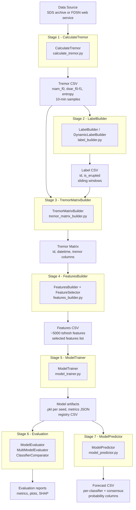

---

## 2. Stage 1 - CalculateTremor

`CalculateTremor` reads raw seismic waveforms from a local SDS archive or a remote FDSN
web service, computes three complementary tremor metrics across multiple frequency bands,
and writes the result to a merged CSV file with 10-minute sampling intervals. Days are
processed in parallel via `joblib` with `n_jobs` workers.

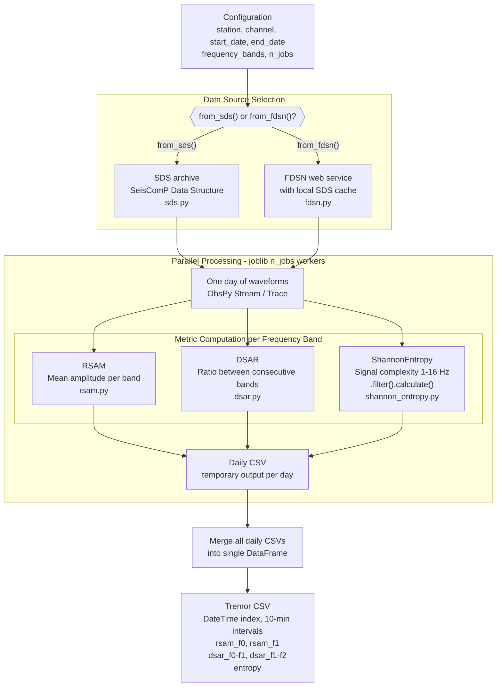

**Notes:**
- Frequency bands default to `(0.01-0.1), (0.1-2), (2-5), (4.5-8), (8-16) Hz`, aliased as `f0..f4`.
- `FDSN` caches downloaded data as SDS miniSEED so subsequent runs skip the network.
- Daily CSV files are optionally cleaned up after merging (`cleanup_daily_dir=True`).

---

## 3. Stage 2 - LabelBuilder

`LabelBuilder` divides a date range into overlapping sliding windows and assigns a binary
label to each window: `1` if the window falls within `day_to_forecast` days before a known
eruption date, `0` otherwise. `DynamicLabelBuilder` is a subclass that instead creates one
isolated window per eruption event spanning `days_before_eruption` days, then concatenates
all windows with unique IDs.

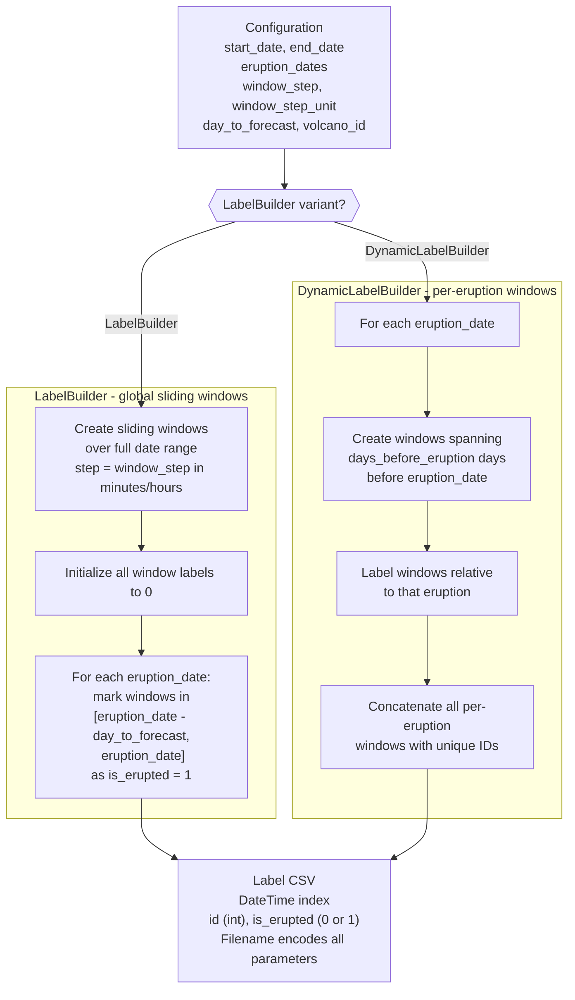

**Notes:**
- Label filename convention: `label_YYYY-MM-DD_YYYY-MM-DD_ws-X_step-X-unit_dtf-X.csv`.
- `LabelData` parses all parameters back from the filename via `cached_property`.

---

## 4. Stage 3 - TremorMatrixBuilder

`TremorMatrixBuilder` aligns the continuous tremor time-series with the discrete label
windows. For every window defined in the label DataFrame it slices the tremor DataFrame,
validates that the expected number of samples is present, prepends the window `id`, and
stacks all slices into a single matrix ready for feature extraction.

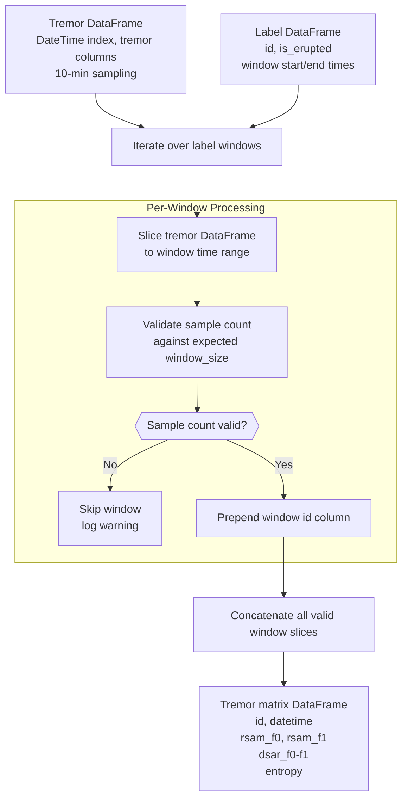

---

## 5. Stage 4 - FeaturesBuilder and FeatureSelector

`FeaturesBuilder` runs tsfresh automated feature extraction on the tremor matrix. It
operates in two distinct modes depending on whether labels are provided. After extraction,
`FeatureSelector` applies a two-stage selection pipeline to reduce the ~5000 tsfresh
features to a manageable, statistically relevant subset.

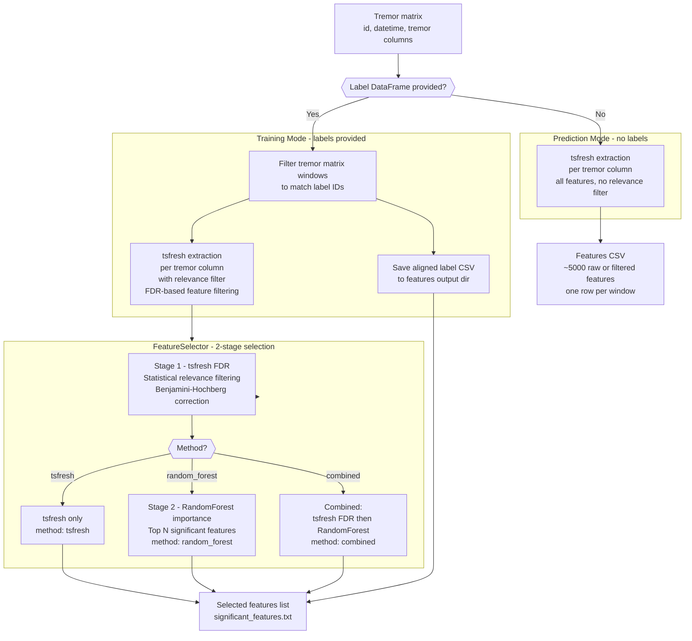

---

## 6. Stage 5 - ModelTrainer

`ModelTrainer` trains one or more classifiers across multiple random seeds in parallel.
The `fit()` method dispatches to one of two training modes controlled by the
`with_evaluation` flag. All seed runs for a given classifier are executed via
`joblib.Parallel` with the `loky` backend for safe nested parallelism.

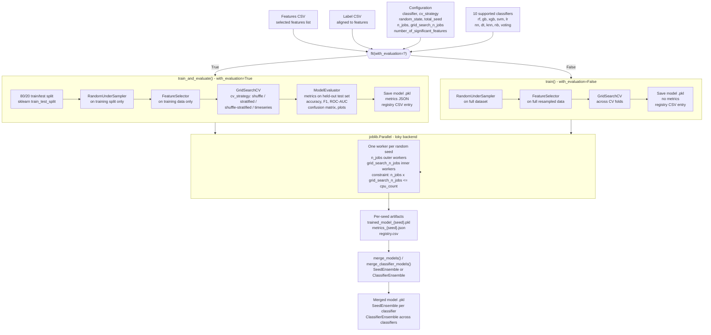

**Notes:**
- Resampling and feature selection always occur inside the train split to prevent data leakage.
- `cv_strategy` options: `shuffle`, `stratified`, `shuffle-stratified`, `timeseries`.

---

## 7. Stage 6 - Evaluation

Three evaluator classes are provided at increasing levels of aggregation. `ModelEvaluator`
handles one seed, `MultiModelEvaluator` aggregates across all seeds for one classifier, and
`ClassifierComparator` compares multiple classifiers side by side.

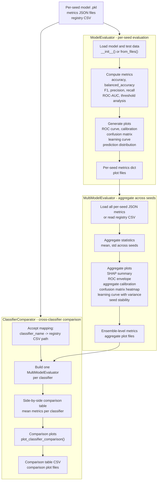

---

## 8. Stage 7 - ModelPredictor

`ModelPredictor` runs inference using models produced by `ModelTrainer`. It supports two
operating modes: evaluation mode (requires labels) and forecast mode (unlabelled). In
multi-model consensus mode it aggregates eruption probability across all seeds of each
classifier (`SeedEnsemble`) and optionally across classifiers (`ClassifierEnsemble`).

```mermaid
flowchart TD
    IN_MODELS["Trained model(s)<br/>SeedEnsemble .pkl per classifier<br/>or ClassifierEnsemble .pkl"]
    IN_TREMOR["New tremor CSV<br/>Datetime index, tremor columns"]

    MODE{{"Operating mode?"}}

    subgraph EVAL_MODE["Evaluation Mode - future_labels_csv provided"]
        PREP_E["Load tremor data<br/>TremorData"]
        MATRIX_E["TremorMatrixBuilder<br/>slice into labeled windows"]
        FEAT_E["FeaturesBuilder<br/>extract tsfresh features<br/>prediction mode"]
        ALIGN_LABELS["Align features to label windows"]
        PREDICT["predict() or predict_best()<br/>requires labels"]
        METRICS_E["Compute per-classifier metrics<br/>accuracy, F1, recall<br/>ROC-AUC, balanced accuracy"]
        OUT_E["Evaluation results<br/>per-seed and per-classifier metrics<br/>plots via ModelEvaluator"]
    end

    subgraph FORECAST_MODE["Forecast Mode - no labels"]
        PREP_F["Load tremor data<br/>TremorData"]
        MATRIX_F["TremorMatrixBuilder<br/>slice into unlabeled windows"]
        FEAT_F["FeaturesBuilder<br/>extract tsfresh features<br/>prediction mode"]
        PROBA["predict_proba()<br/>no labels required"]
        AGG_SEED["SeedEnsemble<br/>aggregate across seeds per classifier<br/>mean probability + uncertainty"]
        AGG_CLF{{"Multi-classifier?"}}
        CLF_ENS["ClassifierEnsemble<br/>aggregate across classifiers<br/>consensus probability + uncertainty"]
        SINGLE_OUT["Single-classifier output<br/>probability, uncertainty<br/>confidence, prediction columns"]
        MULTI_OUT["Multi-classifier output<br/>per-classifier dashed columns<br/>consensus solid column<br/>shaded uncertainty band"]
        OUT_F["Forecast CSV<br/>Datetime index<br/>{name}_eruption_probability<br/>{name}_uncertainty<br/>{name}_confidence<br/>{name}_prediction<br/>consensus_* columns"]
        PLOT_F["Forecast plot<br/>plot_forecast() or<br/>plot_forecast_with_events()"]
    end

    IN_MODELS --> MODE
    IN_TREMOR --> MODE
    MODE -->|"labels provided"| EVAL_MODE
    MODE -->|"no labels"| FORECAST_MODE

    PREP_E --> MATRIX_E --> FEAT_E --> ALIGN_LABELS --> PREDICT --> METRICS_E --> OUT_E
    PREP_F --> MATRIX_F --> FEAT_F --> PROBA --> AGG_SEED --> AGG_CLF
    AGG_CLF -->|"No"| SINGLE_OUT --> OUT_F
    AGG_CLF -->|"Yes"| CLF_ENS --> MULTI_OUT --> OUT_F
    OUT_F --> PLOT_F
```

---

## 9. Ensemble Model Architecture

The ensemble objects produced by `merge_models()` and used by `ModelPredictor` form a
two-level hierarchy. Both levels extend `BaseEnsemble` for consistent serialisation
via joblib.

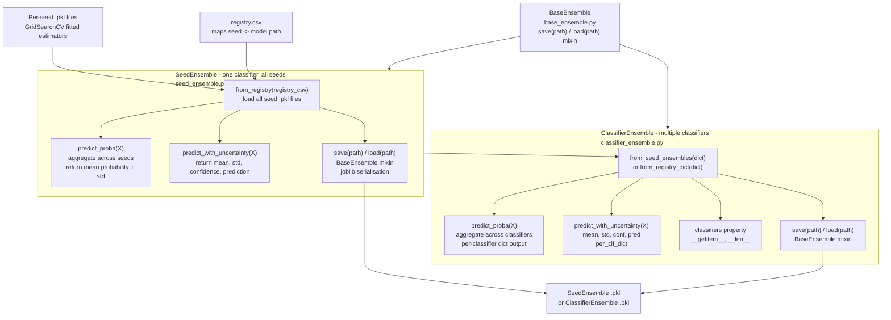

---

## 10. Data Artifacts and Output Directory Structure

This diagram shows all file artifacts produced at each stage and where they are written
relative to `root_dir`.

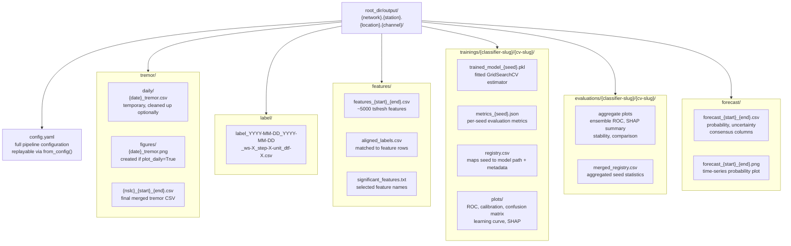

---

## 11. ForecastModel Method Chaining API

`ForecastModel` exposes every pipeline stage as a chainable method. This diagram shows
the full call sequence and the optional paths available to users.

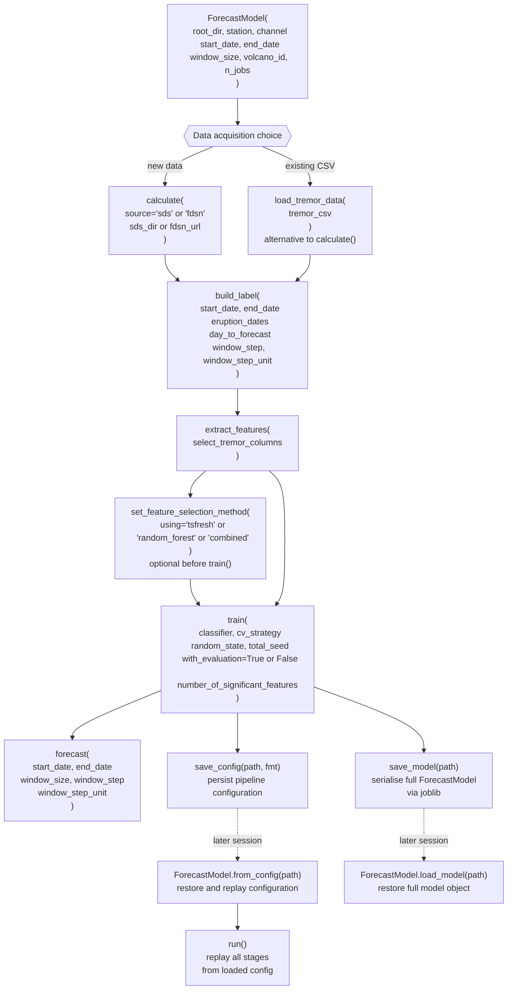

---

*Author: martanto*
*Last updated: 2026-03-10*
